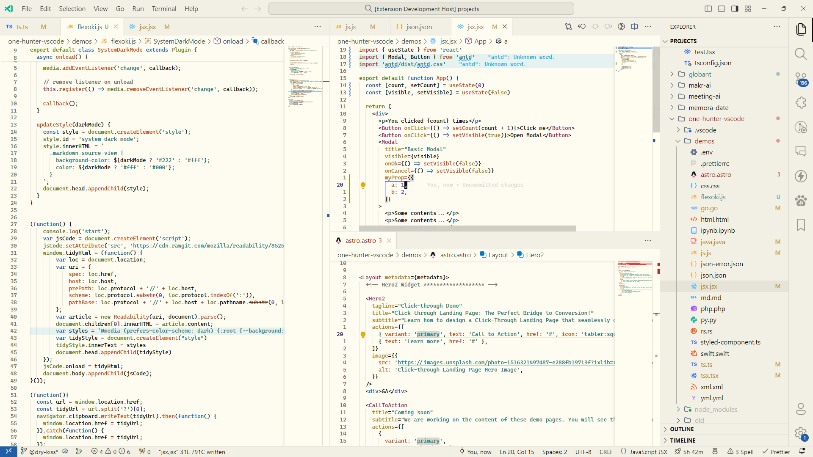

# Flexoki Light for Visual Studio Code

A standalone Visual Studio Code extension providing the **Flexoki Light** theme, extracted from [Railly Hugo's one-hunter-vscode](https://github.com/Railly/one-hunter-vscode).

Flexoki is an inky color scheme designed by [Steph Ango](https://stephango.com/flexoki) for long reading and writing sessions on digital screens. It pairs warm paper-tone backgrounds with deeply pigmented syntax accents.



## Palette Reference

| Role | Color Name | Hex | Usage |
| :--- | :--- | :--- | :--- |
| **Base** | Paper | `#FFFCF0` | Editor background |
| **Base 2** | Paper 2 | `#F2F0E5` | Inactive tabs, widgets, sections |
| **UI 1** | UI | `#E6E4D9` | Selections, notifications |
| **UI 2** | UI 2 | `#DAD8CE` | Borders, hover states, list hovers |
| **UI 3** | UI 3 | `#CECDC3` | Line numbers, subtle guides |
| **Text** | Ink | `#100F0F` | Primary text and foreground |
| **Text 2** | Ink 2 | `#6F6E69` | Comments, subtle text |
| **Text 3** | Ink 3 | `#B7B5AC` | Documentation comments |
| **Red** | Red | `#AF3029` | Imports, errors, deleted |
| **Orange** | Orange | `#BC5215` | Functions, classes, enums, warnings |
| **Yellow** | Yellow | `#AD8301` | Interfaces, types, booleans |
| **Green** | Green | `#66800B` | Methods, variables, added |
| **Cyan** | Cyan | `#24837B` | Strings, modified, badges |
| **Blue** | Blue | `#205EA6` | Properties, storage modifiers, info |
| **Purple** | Purple | `#5E409D` | Constants, numbers |
| **Magenta** | Magenta | `#A02F6F` | Preprocessor, global variables, tags |

## Installation

### Option 1: Install packaged VSIX via CLI

Build or locate the packaged extension in `dist/`, then run:

```bash
code --install-extension dist/vscode-flexoki-light-mikusr-1.0.0.vsix
```

*(If using Cursor or VSCodium, replace `code` with `cursor` or `codium`.)*

### Option 2: Install via VS Code GUI

1. Open the Extensions sidebar (`Ctrl+Shift+X` or `Cmd+Shift+X`).
2. Click the `...` menu (Views and More Actions) at the top of the Extensions pane.
3. Select **Install from VSIX...**
4. Choose `dist/vscode-flexoki-light-mikusr-1.0.0.vsix`.

### Option 3: Direct Symlink (Developer Mode)

Link this directory directly into your VS Code extensions folder:

```bash
ln -s "$(pwd)" ~/.vscode/extensions/vscode-flexoki-light-mikusr
```

Restart VS Code or run **Developer: Reload Window** from the Command Palette (`Ctrl+Shift+P`).

## Building the Package

To package the extension into a `.vsix` file:

```bash
./build-extension.sh
```

This uses `@vscode/vsce` to create `dist/vscode-flexoki-light-mikusr-1.0.0.vsix`.

## Credits

- Extracted from [one-hunter-vscode](https://github.com/Railly/one-hunter-vscode) by [Railly Hugo](https://github.com/Railly).
- Original [Flexoki](https://github.com/kepano/flexoki) color specification by [Steph Ango](https://stephango.com/flexoki).

## License

[MIT](LICENSE)
